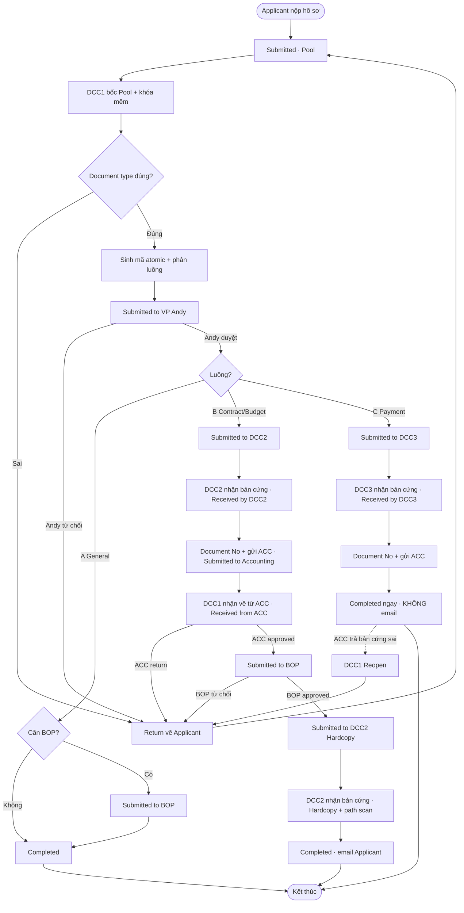
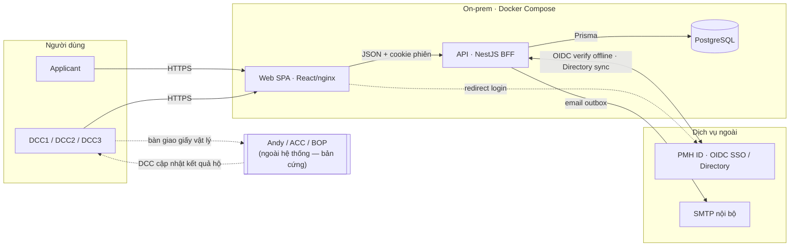
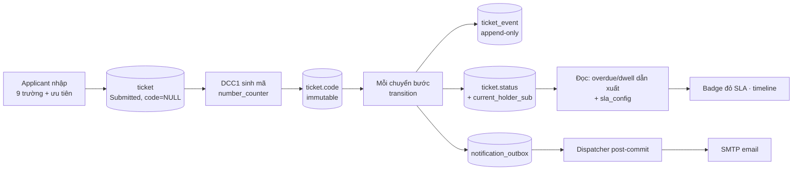
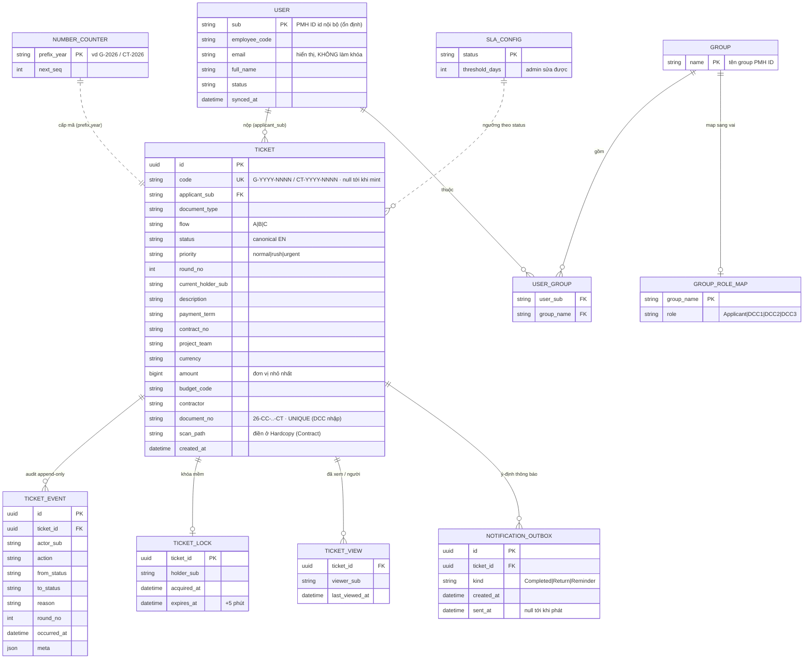
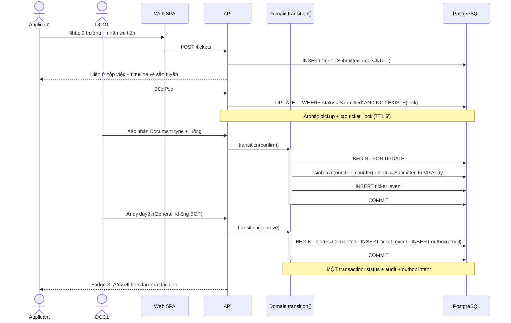
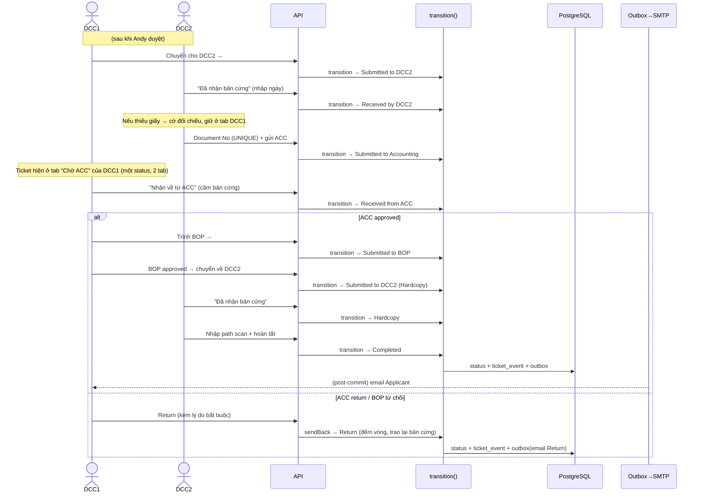
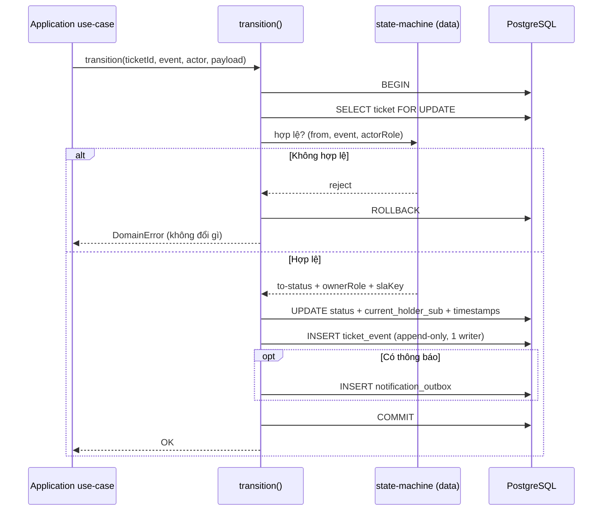

# QLHS — Business Overview, Main Flow & Data Flow

Tài liệu tổng quan hệ thống quản lý hồ sơ QLHS: **vì sao làm**, **kết quả kỳ vọng**, **luồng chính**, **luồng dữ liệu**, kèm sơ đồ **ER** và **sequence**. Thuật ngữ kỹ thuật và tên trạng thái giữ tiếng Anh (canonical).

---

## 1. Business Overview

Hồ sơ nội bộ (hợp đồng, thanh toán, ngân sách…) đi qua nhiều vai — **Applicant → DCC1 → DCC2/DCC3 → Andy/ACC/BOP** — nhưng không ai nhìn thấy hồ sơ đang ở đâu, chờ ai, bao lâu. Applicant nộp xong là mù thông tin; bị trả về không rõ lý do; việc giao–nhận không để lại dấu vết tra cứu được.

QLHS biến mỗi hồ sơ thành một **ticket minh bạch, tự vận hành**. Nguyên tắc thiết kế số 1: **"Minh bạch thay cho luật cứng"** — hệ thống không ép quy trình bằng quy định, mà làm mọi thứ hiển thị rõ (timeline hiện trạng, dấu "đã xem", badge quá hạn, lý do return bắt buộc). Sự hiển thị tạo áp lực xử lý — không cần cảnh sát quy trình.

### Vai trò

| Vai | Trong/ngoài hệ thống | Việc chính |
|---|---|---|
| **Applicant** | Trong | Mọi nhân viên; tạo/gửi ticket, theo dõi, sửa khi bị return; chỉ thấy hồ sơ của mình |
| **DCC1** | Trong | Nhận từ Pool, sinh mã, trình Andy, phân luồng; đầu mối Return/Reopen |
| **DCC2** | Trong | Luồng Contract/Budget: làm việc bản cứng với ACC/BOP, hoàn tất Hardcopy |
| **DCC3** | Trong | Luồng Payment: gửi ACC, đóng ticket |
| **Andy / ACC / BOP** | **Ngoài** | Duyệt/ký/kiểm trên bản cứng ngoài hệ thống; DCC cập nhật kết quả hộ |

### Ba luồng nghiệp vụ

- **Luồng A — General:** DCC1 xử suốt tuyến; Andy duyệt (có thể kèm BOP) → Completed.
- **Luồng B — Contract / VO / Annex / Budget:** DCC2 ↔ ACC → DCC1 trình BOP → DCC2 Hardcopy → Completed.
- **Luồng C — Payment:** DCC3 gửi ACC = Completed ngay (không BOP, không email Applicant).

---

## 2. Business Outcome

### Đau → Giải → Kết quả đo được

| Đau hiện tại | QLHS giải bằng | Outcome đo được |
|---|---|---|
| Applicant mù thông tin, phải đi hỏi | Timeline "bản đồ ga tàu" + trạng thái realtime | **100% hồ sơ tra được vị trí realtime** |
| Giao–nhận không dấu vết | Audit log **bất biến** mọi cú chuyển | **100% cú giao–nhận có log đầy đủ** |
| Hồ sơ "kẹt im lặng" | Badge đỏ SLA theo từng chặng + nhắc email | Hồ sơ quá hạn **hiện đỏ tự động**, không escalate thủ công |
| Bị return không rõ lý do | Lý do return **bắt buộc** trên timeline + email | Applicant tự sửa, không cần hỏi ai |
| Trạng thái hệ thống lệch thực tế giấy | Bàn giao bản cứng **2 pha** (bên nhận xác nhận) | Trạng thái **khớp thực tế vật lý** |

### Giá trị theo stakeholder

- **Applicant:** tự biết hồ sơ ở đâu mọi lúc; sửa nhanh khi bị trả về; nộp gấp có nhãn ưu tiên.
- **DCC:** hộp việc rõ ràng theo tab-trạng-thái; không nhận trùng (khóa mềm); đầu mối Return/Reopen tập trung.
- **Tổ chức:** dấu vết kiểm toán đầy đủ; nền dữ liệu timestamp cho dashboard điểm nghẽn (giai đoạn 2).

### Counter-metric (chống tối ưu lệch)

Thời gian trung bình mỗi hồ sơ **không được tăng** so với quy trình giấy hiện tại.

### Ngoài phạm vi GĐ1

Tài khoản + nút duyệt trong hệ thống cho Andy/ACC/BOP; dashboard analytics; realtime push (dùng polling); đổi luồng tại chỗ.

> **Known-limitation (đã chốt):** audit ghi kết quả Andy/ACC/BOP do DCC nhập — chứng minh *DCC đã ghi gì, lúc nào*, không xác thực chữ ký gốc. Minh bạch đảm bảo trong phạm vi vòng DCC.

---

## 3. Main Flow

Giai đoạn đầu chung cho cả 3 luồng, sau đó rẽ theo Document type.



**Bất biến của luồng:** trình Andy 1 lần & BOP ≤1 lần **trong một vòng**; return đếm-vòng mở round mới chạy lại cửa. Mã hồ sơ sinh một lần, giữ nguyên qua mọi vòng. Mỗi điểm bàn giao bản cứng cần bên nhận **xác nhận đã cầm giấy** mới tiến bước.

---

## 4. Data Flow

### 4.1 Tổng quan luồng dữ liệu (hệ thống)



**Nguyên tắc dữ liệu:**
- Mọi đổi trạng thái đi qua **một** `transition()` trong **một DB transaction**: ghi `status` + `current_holder_sub` + **đúng một `ticket_event`** (audit) + (nếu cần) **outbox** thông báo.
- **Audit append-only** (GRANT chỉ INSERT+SELECT) — dấu vết không sửa/xóa.
- **SLA/dwell là giá trị dẫn xuất** lúc đọc (không lưu cờ); ngưỡng cấu hình được.
- **Danh tính** = PMH ID `sub` (không dùng email); vai suy từ claim `groups`.
- **Thông báo** = hàm của sự kiện đã commit, phát post-commit exactly-once (Payment Completed **không** email).

### 4.2 Vòng đời dữ liệu một ticket



---

## 5. ER Diagram



---

## 6. Sequence — Data Flow

### 6.1 Đăng nhập qua PMH ID (OIDC / BFF)

```mermaid
sequenceDiagram
  actor U as Nhân viên
  participant W as Web SPA
  participant A as API (BFF)
  participant P as PMH ID (OIDC)

  U->>W: Mở app
  W->>A: GET /me
  A-->>W: 401 (chưa có phiên)
  W->>A: GET /auth/login
  A->>P: Redirect Authorization Code (Discovery URL)
  U->>P: Đăng nhập (trang PMH ID)
  P-->>A: /auth/callback?code=...
  A->>P: Đổi code lấy token (client_secret)
  P-->>A: access + refresh (JWT RS256)
  A->>A: Verify offline JWKS (kid, iss, aud)
  A->>A: Map groups→role; tạo phiên cookie httpOnly
  A-->>W: Set-Cookie; vào app
  Note over A,P: refresh token GIỮ ở API · access ~5' · idle 15' · PMH ID sập vẫn dùng tiếp tới khi hết hạn
```

### 6.2 Applicant tạo hồ sơ → DCC1 xử General → Completed (walking skeleton)



### 6.3 Luồng Contract — bàn giao 2 pha, ACC, BOP, Hardcopy



### 6.4 Nội bộ `transition()` — bất biến ghi atomic



---

## Tham chiếu

- Hợp đồng kiến trúc (20 AD): `_bmad-output/planning-artifacts/architecture/.../ARCHITECTURE-SPINE.md`
- SPEC (12 capability): `_bmad-output/specs/spec-qlhs/SPEC.md`
- Yêu cầu chi tiết (FR/NFR, state machine, SLA): `_bmad-output/planning-artifacts/prds/.../prd.md`
- Epics & stories: `_bmad-output/planning-artifacts/epics.md`
